# CLAUDE.md

This file provides guidance to Claude Code (claude.ai/code) when working with code in this repository.

## Project

Full-stack crypto intelligence dashboard with an AI-powered chat assistant. Split into three services:

- **Frontend** (`frontend/`) — React 19 + Vite, port `:5173`
- **Gateway** (`backend-node/`) — Fastify + TypeScript, port `:8000`. Owns market data (Binance, CoinGecko) and proxies chat to the agent service.
- **Agent Service** (`agent_service/`) — FastAPI + LangGraph + Google Gemini, port `:8001`. Only owns the LLM pipeline.

## Commands

**Start everything** (three separate windows on Windows):
```
start.bat
```

**Run services individually:**

Gateway:
```bash
cd backend-node
npm run dev          # tsx watch on :8000
npm run typecheck    # tsc --noEmit
```

Agent service (run from project root):
```bash
python -u -m uvicorn agent_service.api.main:app --host 0.0.0.0 --port 8001
```

Frontend:
```bash
cd frontend
npm run dev          # :5173
npm run build
```

**Install:**
```bash
pip install -r agent_service/requirements.txt
cd backend-node && npm install
cd frontend && npm install
```

**Generate agent graph visualization:**
```bash
python agent_service/scripts/gen_graph.py
```

## Environment

**`backend-node/.env`** (Gateway):
```
PORT=8000
LOG_LEVEL=debug
PYTHON_AGENT_URL=http://localhost:8001
BINANCE_BASE_URL=https://api.binance.com
COINGECKO_BASE_URL=https://api.coingecko.com
COINGECKO_API_KEY=        # optional, public endpoints work without it
SUPABASE_URL=             # https://<proj>.supabase.co
SUPABASE_ANON_KEY=        # public JWT, used for token validation if needed
SUPABASE_SERVICE_ROLE_KEY=# writes to chats + reads admin endpoints
ADMIN_EMAILS=             # CSV of emails allowed into /admin
```

**`agent_service/.env`** (Agent):
```
AI_API_KEY=<Google Gemini API key — required>
AI_MODEL=gemini-3.1-flash-lite
LOG_LEVEL=DEBUG
PYTHONUNBUFFERED=1        # critical on Windows for live log streaming
SUPABASE_URL=             # SAME project as the gateway
SUPABASE_SERVICE_ROLE_KEY=# writes node_traces from inside the graph
```

**`frontend/.env`** (Frontend, Vite prefixes vars with `VITE_`):
```
VITE_SUPABASE_URL=        # SAME project as backend + agent
VITE_SUPABASE_ANON_KEY=   # public anon key
VITE_ADMIN_EMAILS=        # CSV used only for UX (showing /admin link)
```

Copy from `agent_service/.env.example` and `backend-node/.env.example`. The three `SUPABASE_URL` values MUST point at the same project — schema mismatches between services were the most common cause of silent audit failures during development.

Settings are loaded via pydantic-settings in `agent_service/settings.py` and `@fastify/env` in `backend-node/src/config.ts`.

## Architecture

### System diagram

```mermaid
flowchart LR
    subgraph User["User"]
        Browser[("Browser")]
    end

    subgraph FE["frontend/ — React 19 + Vite :5173"]
        ChatPanel["ChatPanel.tsx<br/>messages + history"]
        Sidebar["Heatmap / TrendingPanel<br/>TickerBanner / CandleChart"]
        Hooks["useFetch / usePolling<br/>(AbortController)"]
    end

    subgraph GW["backend-node/ — Fastify :8000 (TypeScript)"]
        Routes["routes/<br/>health · heatmap · ticker/banner<br/>klines · trending · chat"]
        Plugins["plugins/<br/>binance · coingecko · pythonAgent<br/>swagger"]
        Schemas["schemas/<br/>TypeBox + shared/types"]
        Routes -- "fastify.decorate" --> Plugins
        Routes -. "TypeBox validation" .-> Schemas
    end

    subgraph AG["agent_service/ — FastAPI :8001 (Python)"]
        RunAgent["/run-agent<br/>(message, history?)"]
        LangGraph["LangGraph StateGraph"]
        BinPy["binance/real_client.py<br/>(prices, klines)"]
        GeckoPy["coingecko.py<br/>(dynamic id resolution)"]
        Artifact["artifacts/graph.png<br/>refreshed on startup"]

        RunAgent --> LangGraph
        LangGraph --> BinPy
        LangGraph --> GeckoPy
        RunAgent -.- Artifact
    end

    subgraph EXT["External APIs"]
        Binance[("Binance<br/>api.binance.com")]
        CoinGecko[("CoinGecko<br/>api.coingecko.com")]
        Gemini[("Google Gemini<br/>generativelanguage")]
    end

    Browser -- "HTTP/JSON" --> ChatPanel
    Browser -- "HTTP/JSON" --> Sidebar
    ChatPanel -. "uses" .-> Hooks
    Sidebar  -. "uses" .-> Hooks

    Hooks -- "POST /chat<br/>{message, history}" --> Routes
    Hooks -- "GET /heatmap · /ticker/banner<br/>/klines/:sym · /trending" --> Routes

    Plugins -- "GET /ticker/24hr<br/>GET /klines" --> Binance
    Plugins -- "GET /search/trending" --> CoinGecko
    Plugins -- "POST /run-agent" --> RunAgent

    BinPy   -- "prices · klines" --> Binance
    GeckoPy -- "GET /search?query=<br/>GET /coins/{id}" --> CoinGecko
    LangGraph -- "ChatGoogleGenerativeAI" --> Gemini

    Routes -- "{response, intent, symbol}" --> Hooks

    classDef ext fill:#1a3a5c,stroke:#88c,color:#fff
    class Binance,CoinGecko,Gemini ext
```



### Request flow (compact)

```
Frontend (Vite :5173)
    └─► proxy /api/* → Gateway (:8000)
            ├─► Binance API           (heatmap, klines, ticker/banner)
            ├─► CoinGecko API         (trending)
            └─► Agent Service (:8001) (chat → POST /run-agent)
                    └─► LangGraph + Gemini
                          └─► Binance + CoinGecko (per-node enrichment)
```

### Gateway (`backend-node/`)

- **`src/server.ts`** — Fastify bootstrap with Pino (`pino-pretty` in dev), `@fastify/env`, `@fastify/cors`, TypeBox type provider.
- **`src/config.ts`** — `ConfigSchema` (TypeBox) defines and validates env at startup.
- **`src/clients/`** — `binance.ts`, `coingecko.ts`, `pythonAgent.ts`. Registered as Fastify decorators via `src/plugins/`, instantiated once at startup. Methods accept an optional `request.log` so logs stay correlated with `reqId`.
- **`src/plugins/`** — one Fastify plugin per client (`fastify-plugin` wrapper + `decorate` + module augmentation). Registered in `server.ts` BEFORE the routes.
- **`src/clients/_fetch.ts`** — `fetchWithTimeout` (AbortController) used by every upstream call.
- **`src/clients/_errors.ts`** — `UpstreamParseError`, `UpstreamShapeError`, `InvalidSymbolError`.
- **`src/utils/parseNum.ts`** — strict `Number()` replacement that throws on NaN.
- **`src/utils/market.ts`** — `topByVolume` used by `heatmap` and `tickerBanner` routes.
- **`src/schemas/`** — TypeBox schemas. `market.ts` defines `Ticker`/`Kline`/`TrendingCoin` shapes (validated runtime) plus assignability checks against the shared interfaces. `chat.ts` defines `ChatRequest` (with optional `history`) / `ChatResponse` (with optional `intent`, `symbol`).
- **`src/routes/`** — one file per endpoint. All use `FastifyPluginAsyncTypebox` so request/response are typed and validated. `klines` interval is a TypeBox literal union so invalid values get a 400 with a clear message (not a fake "Invalid symbol"). Each route's `schema` carries `tags`/`summary`/`description` for Swagger.
- **`src/plugins/swagger.ts`** — registers `@fastify/swagger` + `@fastify/swagger-ui` ONLY when `NODE_ENV !== 'production'`. UI at `/docs`, raw OpenAPI 3 spec at `/docs/json`. The spec is generated automatically from each route's TypeBox schema — no parallel YAML to maintain.
- **`src/plugins/supabase.ts`** — decorates `fastify.supabase` with a service-role client. Used for token validation (`auth.getUser(jwt)`) and for writes to `chats` from the `/chat` handler. The service role bypasses RLS, so this client is NEVER exposed to the frontend.
- **`src/plugins/auth.ts`** — decorates `fastify.verifyAuth` and `fastify.verifyAdmin` preHandlers. `verifyAuth` extracts a `Bearer` token and resolves the user via Supabase Auth (sets `request.user = { id, email }`). `verifyAdmin` chains `verifyAuth` then 403s if `request.user.email` is not in `ADMIN_EMAILS`. Applied per-route — `/chat` uses `verifyAuth`; `/admin/*` uses `verifyAdmin`. `/heatmap`, `/ticker/banner`, `/klines`, `/trending`, `/health` remain public.
- **`src/routes/admin.ts`** — `GET /admin/sessions`, `GET /admin/sessions/:id/chats`, `GET /admin/chats/:id/traces`. Reads `chats` and `node_traces` via the service-role client. All three protected by `verifyAdmin`.

### Agent Service (`agent_service/`)

- **`api/main.py`** — minimal FastAPI app exposing only `POST /run-agent` and `GET /health`. Compiles the graph once at startup AND calls `_regenerate_graph_png()` so `artifacts/graph.png` reflects the current pipeline every time the service boots. Failure of the regeneration is logged at warning level and does not block startup.
- **`agents/chat/graph.py`** — LangGraph `StateGraph` definition.
- **`agents/chat/nodes.py`** — async node functions updating `ChatState`. Uses `binance/` and `coingecko.py` internally (price_fetcher, market_scout, coin_info nodes). `intent_router` is the only node that consumes `state["history"]` for symbol carryover.
- **`agents/shared/state.py`** — `ChatState` TypedDict; includes `history: list[ConversationTurn]` for conversation memory.
- **`coingecko.py`** — CoinGecko client used by the `coin_info` node. Resolves `Binance symbol → CoinGecko id` dynamically via `GET /api/v3/search` (no hardcoded mapping). Two in-memory caches: `_id_cache` (24h for resolution hits, 10 min for misses) and `_info_cache` (1h for the rendered info block). Network errors bypass the cache so a retry can succeed. Pick rule: prefer an exact case-insensitive symbol match in the search results; fall back to `coins[0]` (CoinGecko already ranks by market cap).
- **`supabase_client.py`** — lazy singleton. `get_client()` returns `None` when creds are missing or the `supabase` package is not installed, so audit writes silently no-op in dev. `insert_trace()` is fire-and-forget — it never raises into the graph, only logs warnings. Imported lazily from `_helpers._log_llm` to avoid circular imports.
- **`agents/chat/nodes/_helpers.py`** — `_llm(state, temperature)` reads the model dynamically from `state.get("model")` (falls back to `settings.AI_MODEL`). `_log_llm(state, node_name, messages, response_text, latency_ms, error?)` is the single instrumentation point: every node with an LLM call wraps the `ainvoke` in `time.perf_counter()`, then calls `_log_llm` with the latency. When `state["chat_id"]` is present, this fires off the row to `node_traces`.

LangGraph flow:
```
intent_router
├─► market_scout → END             (market_overview intent)
├─► no_symbol → END                (crypto question, coin not identified)
├─► off_topic → END                (question is not about crypto at all)
├─► coin_info → END                (fundamentals via CoinGecko)
└─► price_fetcher → data_validator
        ├─► price_only → END       (price_only intent or bad data)
        └─► chart_analyst → finance_expert → crypto_expert → reviewer → END
```

`reviewer` synthesizes the three specialist analyses into a final Spanish-language report with BUY/SELL/HOLD recommendation and a Binance trading link. Every node has try/except with a degraded fallback response.

`off_topic` and `no_symbol` are deliberately distinct terminal nodes with different copy:
- `no_symbol` ("No identifiqué ninguna criptomoneda… opciones: BTC, ETH…") assumes the user asked about crypto but the symbol was ambiguous.
- `off_topic` ("Soy un asistente especializado en criptomonedas…") assumes the question is outside scope (weather, greetings, politics).
Mixing them confuses users — see the "Conversation memory" section below for why this distinction is load-bearing.

### API documentation

In dev (`NODE_ENV !== 'production'`):

- **Interactive UI**: <http://localhost:8000/docs> — Swagger UI with the 6 endpoints grouped under `Market`, `Chat`, `System` tags. "Try it out" works against the live gateway.
- **Raw OpenAPI 3 spec**: <http://localhost:8000/docs/json> — useful for client SDK generation or piping into Postman/Insomnia.

In production both endpoints return 404 (plugin not registered). Re-enable by setting `NODE_ENV` to anything other than `production`.

### Contract between Gateway and Agent

- Gateway sends: `POST :8001/run-agent { "message": string, "history"?: ConversationTurn[], "model"?: string, "session_id": string, "chat_id": string }`. The gateway generates `chat_id` (UUID v4) and inserts a stub row into `chats` BEFORE calling the agent so the `node_traces.chat_id` FK is satisfied while the graph runs. After the agent returns, the gateway UPDATEs that row with `intent`, `symbol`, `response`, and `latency_ms`.
- Agent returns: full `ChatState` serialized as JSON (every field optional). The agent itself writes into `node_traces` from inside each node via `_log_llm` — the gateway never sees the trace rows.
- Gateway flattens to `{ "response": string, "intent"?: string, "symbol"?: string | null }` for the frontend. `intent` and `symbol` are exposed so the frontend can stash them on the assistant message and replay them as compact history on the next turn. The full state is logged with `{intent, symbol, responseLength, latency_ms}` at debug level (NOT the full state — that includes kline arrays).

### Conversation memory

The chat is **client-side stateful**. The frontend (`ChatPanel.tsx`) keeps its `messages: Message[]` array and on every `POST /chat` builds a compact `history` via `buildHistory()`:

- User turns send `{role: 'user', content: <text>}`.
- Assistant turns send only `{role: 'assistant', symbol, intent}` — the long reviewer text is NOT sent. The router only needs the symbol to resolve implicit references.

Only the `intent_router` node consumes `state["history"]`. The carryover is **delegated to the LLM**, not done blindly in Python:

1. The history is rendered as a Spanish context block inside the SystemMessage.
2. The prompt teaches the LLM the carryover rules with explicit examples:
   - Explicit symbol in current message → always wins over context.
   - Implicit crypto reference ("comprar?", "subió?") → carry over the last assistant symbol.
   - Off-topic question (weather, greetings, code help) → return `intent='off_topic'`, `symbol=null`. **Never** carry over.
3. Defensive Python normalization runs after: `intent='off_topic'` forces `symbol=None`, and `intent in {price_only, analysis, coin_info}` without a symbol downgrades to `no_symbol`.
4. `_last_symbol_from_history()` survives only in the `except` path. If the LLM call or JSON parse fails, we fall back to `analysis` with the previous symbol (better than dropping the user's context).

**Why this design**: an earlier version did the carryover in Python regardless of intent. After "deberia vender Tron?" → "cómo está el clima en Miami?" it replayed a TRX analysis because Python had no way to know the new question wasn't crypto. The LLM does — it just needs explicit instructions.

History is capped at 10 turns (`MAX_HISTORY_TURNS` in `ChatPanel.tsx`). Refreshing the browser or clicking the ↺ button in the context bar resets the conversation — there is no server-side store. The context bar shows a progress indicator (`N/MAX contexto`) between the message list and the input area. It only renders when there are messages. The bar color shifts from blue (`--color-accent`) through orange (`#ff9800`) to red (`--color-red`) as the context window fills up (thresholds at 70% and 90%).

The shared shapes live at `shared/types/chat.ts` (`ConversationTurn`, extended `ChatRequest`/`ChatResponse`, `AgentIntent` union including `'off_topic'`). Both the gateway TypeBox schemas and the frontend hooks reference them.

### Frontend

- **`main.tsx`** — wraps `<App />` in `<BrowserRouter>` and `<AuthProvider>`. Router goes OUTSIDE Auth so `useNavigate` works inside auth callbacks.
- **`App.tsx`** — `<Routes>` with `/` (home layout) and `/admin` (wrapped in `<ProtectedRoute requireAdmin>`). Home layout = `TickerBanner` (top), sidebar (Heatmap + TrendingPanel), main area (ChatPanel). Below 768px the sidebar collapses behind a hamburger button and slides in as an overlay drawer. Header always shows the auth state (login button or avatar+email+logout, plus an Admin link if the email matches `VITE_ADMIN_EMAILS`).
- **`auth/AuthProvider.tsx`** — Context with `user`, `loading`, `signInWithGoogle`, `signOut`. Hydrates from `supabase.auth.getSession()` and stays in sync via `onAuthStateChange`.
- **`auth/ProtectedRoute.tsx`** — gates a subtree. `requireAdmin` does a client-side check against `VITE_ADMIN_EMAILS` for UX only — the real enforcement is server-side via `verifyAdmin`.
- **`lib/supabase.ts`** — single Supabase client used by the frontend (anon key).
- **`api.ts`** — `getJson`/`postJson` inject `Authorization: Bearer <jwt>` from the current Supabase session before each request. Headers are merged correctly (a bug in the original implementation overwrote `Content-Type` when callers passed their own headers).
- **`ChatPanel.tsx`** — ref-forwarded; `injectText(ticker)` lets sidebar components inject coin symbols into chat. Cancels the previous in-flight request via `abortRef` when a new send fires. Gated by `useAuth` — if `!user` shows a login CTA instead of the chat. Generates a `session_id` (UUID v4) on mount and sends it with every `/chat` request. Below the input, a strip holds the `<Select>` (model picker) and the disclaimer text.
- **`components/Select.tsx`** — headless custom select. Generic `<T extends string>`, opens UPWARD (`bottom-full`) since it lives at the foot of the chat, supports keyboard navigation (↑/↓/Enter/Space/Escape), click-outside, hover highlighting. Used instead of native `<select>` because the browser's option dropdown popup ignores theme styles.
- **`pages/AdminDashboard.tsx`** — three drill-down views in one component: sessions → chats → traces. Each trace is an expandable `<details>` showing `prompt_system`, `prompt_user`, `response`, `latency_ms`, and `error`. Only reachable for emails in `VITE_ADMIN_EMAILS` (and server enforces).
- **`CandleChart.tsx`** — candlestick chart rendered with `lightweight-charts` v4 (TradingView). Receives `Kline[]` + `symbol` + `title` props. Mounts the chart imperatively in a `useEffect`, adds a `CandlestickSeries` and a `HistogramSeries` (volume, `priceScaleId: "vol"`), and tears down with `chart.remove()` on unmount. A `ResizeObserver` keeps width in sync with the container. Colors are read at mount time from the design tokens via `getComputedStyle` — **always use the full `--color-*` prefix** (e.g. `--color-green`, not `--color-green`). `--radius-md: 8px` is defined in `base.css` and used by the container's `borderRadius`.
- **`src/api.ts`** — `API_BASE` + `getJson`/`postJson` helpers (single source of truth for the gateway URL).
- **`src/hooks/{useFetch,usePolling}.ts`** — `AbortController`-aware data hooks used by every sidebar panel.
- **`src/styles/base.css`** — Tailwind v4 entry point. Declares `@theme` with all design tokens (colors, animations). Also contains `@layer base` (reset, body, scrollbars), `@layer utilities` (keyframe definitions), and `@layer components` (markdown descendant selectors for `.chat__bubble` that can't be expressed as utility classes).
- `/api/*` requests are proxied by Vite (`vite.config.ts`) to `localhost:8000` (the gateway).

**Styling**: Tailwind v4 via `@tailwindcss/vite` plugin. No CSS files per component — all styles are inline utility classes. Design tokens defined in `@theme` are available as Tailwind classes (e.g. `bg-bg-raised`, `text-text-muted`, `text-green`). Dynamic color values (heatmap tiles, context bar fill) use `var(--color-*)` in inline `style={}` props since they are runtime-computed.

## Authentication & audit

Authentication and persistence live in **Supabase** (Auth + Postgres). Two custom tables drive the audit dashboard:

```sql
chats:        id, session_id, user_id, user_email, message, model, intent, symbol, response, latency_ms, created_at
node_traces:  id, chat_id (FK → chats.id ON DELETE CASCADE), node_name, model, prompt_system, prompt_user, response, latency_ms, error, created_at
```

Schema lives at `supabase/schema.sql` — run it once in the Supabase SQL editor. RLS is disabled on both tables; access is gated by which key is used (service_role for backend writes; the frontend never queries these tables directly — it goes through `/admin/*` which `verifyAdmin` protects).

**Login flow**: frontend calls `supabase.auth.signInWithOAuth({ provider: 'google' })` → Supabase handles the OAuth dance with Google → frontend gets a session with `access_token`. Every API call from `api.ts` injects `Authorization: Bearer <access_token>`. Gateway `verifyAuth` calls `supabase.auth.getUser(token)` to resolve the user. Sessions are JWTs in localStorage (managed by the Supabase SDK).

**Audit lifecycle of one chat turn**:
1. Gateway `/chat` generates `chat_id` (UUID v4).
2. Gateway INSERTs a stub row into `chats` (id, session_id, user_id, user_email, message, model) — fields like `intent`, `symbol`, `response` are still NULL.
3. Gateway calls the agent with `chat_id`, `session_id`, `model` in the body.
4. Each instrumented node in the LangGraph pipeline calls `_log_llm(state, "<node_name>", messages, response, latency_ms)`. `_log_llm` reads `chat_id` from state and fires `insert_trace` on Supabase (fire-and-forget, never raises into the graph).
5. Agent returns the final `ChatState` to the gateway.
6. Gateway UPDATEs the `chats` row with `intent`, `symbol`, `response`, `latency_ms`.

The stub-first ordering is load-bearing: `node_traces.chat_id` has a FK to `chats.id`. If the agent inserts a trace BEFORE the stub exists, Postgres rejects the insert and the `except Exception` in `insert_trace` swallows it. This bit us in development — the only symptom was an empty "Trazas de nodos" panel in the admin dashboard even though the chat itself rendered fine.

**Why two separate insert-trace failure modes look identical**: both `supabase` package not installed and Supabase creds missing make `get_client()` return `None`, which makes `insert_trace` silently no-op. The `[trace.insert]` INFO logs (in `supabase_client.py`) and `[trace]` INFO log (in `_helpers.py:_log_llm`) exist precisely to disambiguate these cases — they print `client=True/False` and `chat_id=<uuid|None>` so you can tell at a glance whether the issue is the env, the FK, or a state propagation bug.

**Admin-only**: `ADMIN_EMAILS` (CSV in env) is the source of truth on the backend. Frontend reads `VITE_ADMIN_EMAILS` only to decide whether to show the "Admin" link in the header — never trust the frontend list.

**Model selector**: the frontend caches the choice in `localStorage('preferred_model')` and sends it on every `/chat` request. Default is `gemini-3.1-flash-lite` (cheap, fast). The agent's `_llm()` reads `state.get("model")` and falls back to `settings.AI_MODEL`. The TypeBox schema on the gateway constrains the value to a union of literals — adding a model means editing `shared/types/chat.ts`, `backend-node/src/schemas/chat.ts`, and the `MODELS` array in `ChatPanel.tsx`.

## LLM response handling

`langchain-google-genai` returns `response.content` as either a string OR a list of content blocks like `[{'type': 'text', 'text': '...', 'extras': {...}}]` depending on the model and SDK version. The `_extract_text()` helper in `agent_service/agents/chat/nodes.py` normalizes both shapes. Always go through it instead of reading `.content` directly.

## Reviewer output format

The reviewer node returns Markdown that the frontend renders via `react-markdown`. Structure (enforced by the prompt):

```
## Recomendación
- 📈 **Short term:** BUY | SELL | HOLD
- 📊 **Medium term:** BUY | SELL | HOLD
- 🔭 **Long term:** BUY | SELL | HOLD

## Análisis
<6-8 sentences>

_Esto no es asesoramiento financiero._
```

Recommendations go first on purpose — they're the actionable summary. The Binance trading link is injected by `_inject_binance_link()` after the reviewer returns.
