# CLAUDE.md

This file provides guidance to Claude Code (claude.ai/code) when working with code in this repository.

## Project

Full-stack crypto intelligence dashboard with an AI-powered chat assistant. Split into three services:

- **Frontend** (`frontend/`) — React 19 + Vite, port `:5173`
- **Gateway** (`backend-node/`) — Fastify + TypeScript, port `:8000`. Owns market data (Binance, CoinGecko) and proxies chat to the agent service.
- **Agent Service** (`agent_service/`) — FastAPI + LangGraph + Google Gemini, port `:8001`. Only owns the LLM pipeline.

## Commands

**Start everything** (three separate windows on Windows):
```
start.bat
```

**Run services individually:**

Gateway:
```bash
cd backend-node
npm run dev          # tsx watch on :8000
npm run typecheck    # tsc --noEmit
```

Agent service (run from project root):
```bash
python -u -m uvicorn agent_service.api.main:app --host 0.0.0.0 --port 8001
```

Frontend:
```bash
cd frontend
npm run dev          # :5173
npm run build
```

**Install:**
```bash
pip install -r agent_service/requirements.txt
cd backend-node && npm install
cd frontend && npm install
```

**Generate agent graph visualization:**
```bash
python scripts/gen_graph.py
```

## Environment

**`backend-node/.env`** (Gateway):
```
PORT=8000
LOG_LEVEL=debug
PYTHON_AGENT_URL=http://localhost:8001
BINANCE_BASE_URL=https://api.binance.com
COINGECKO_BASE_URL=https://api.coingecko.com
COINGECKO_API_KEY=        # optional, public endpoints work without it
```

**`agent_service/.env`** (Agent):
```
AI_API_KEY=<Google Gemini API key — required>
AI_MODEL=gemini-2.0-flash
LOG_LEVEL=DEBUG
PYTHONUNBUFFERED=1        # critical on Windows for live log streaming
```

Settings are loaded via pydantic-settings in `agent_service/settings.py` and `@fastify/env` in `backend-node/src/config.ts`.

## Architecture

### System diagram

```mermaid
flowchart LR
    subgraph User["User"]
        Browser[("Browser")]
    end

    subgraph FE["frontend/ — React 19 + Vite :5173"]
        ChatPanel["ChatPanel.tsx<br/>messages + history"]
        Sidebar["Heatmap / TrendingPanel<br/>TickerBanner / CandleChart"]
        Hooks["useFetch / usePolling<br/>(AbortController)"]
    end

    subgraph GW["backend-node/ — Fastify :8000 (TypeScript)"]
        Routes["routes/<br/>health · heatmap · ticker/banner<br/>klines · trending · chat"]
        Plugins["plugins/<br/>binance · coingecko · pythonAgent<br/>swagger"]
        Schemas["schemas/<br/>TypeBox + shared/types"]
        Routes -- "fastify.decorate" --> Plugins
        Routes -. "TypeBox validation" .-> Schemas
    end

    subgraph AG["agent_service/ — FastAPI :8001 (Python)"]
        RunAgent["/run-agent<br/>(message, history?)"]
        LangGraph["LangGraph StateGraph"]
        BinPy["binance/real_client.py<br/>(prices, klines)"]
        GeckoPy["coingecko.py<br/>(dynamic id resolution)"]
        Artifact["artifacts/graph.png<br/>refreshed on startup"]

        RunAgent --> LangGraph
        LangGraph --> BinPy
        LangGraph --> GeckoPy
        RunAgent -.- Artifact
    end

    subgraph EXT["External APIs"]
        Binance[("Binance<br/>api.binance.com")]
        CoinGecko[("CoinGecko<br/>api.coingecko.com")]
        Gemini[("Google Gemini<br/>generativelanguage")]
    end

    Browser -- "HTTP/JSON" --> ChatPanel
    Browser -- "HTTP/JSON" --> Sidebar
    ChatPanel -. "uses" .-> Hooks
    Sidebar  -. "uses" .-> Hooks

    Hooks -- "POST /chat<br/>{message, history}" --> Routes
    Hooks -- "GET /heatmap · /ticker/banner<br/>/klines/:sym · /trending" --> Routes

    Plugins -- "GET /ticker/24hr<br/>GET /klines" --> Binance
    Plugins -- "GET /search/trending" --> CoinGecko
    Plugins -- "POST /run-agent" --> RunAgent

    BinPy   -- "prices · klines" --> Binance
    GeckoPy -- "GET /search?query=<br/>GET /coins/{id}" --> CoinGecko
    LangGraph -- "ChatGoogleGenerativeAI" --> Gemini

    Routes -- "{response, intent, symbol}" --> Hooks

    classDef ext fill:#1a3a5c,stroke:#88c,color:#fff
    class Binance,CoinGecko,Gemini ext
```



### Request flow (compact)

```
Frontend (Vite :5173)
    └─► proxy /api/* → Gateway (:8000)
            ├─► Binance API           (heatmap, klines, ticker/banner)
            ├─► CoinGecko API         (trending)
            └─► Agent Service (:8001) (chat → POST /run-agent)
                    └─► LangGraph + Gemini
                          └─► Binance + CoinGecko (per-node enrichment)
```

### Gateway (`backend-node/`)

- **`src/server.ts`** — Fastify bootstrap with Pino (`pino-pretty` in dev), `@fastify/env`, `@fastify/cors`, TypeBox type provider.
- **`src/config.ts`** — `ConfigSchema` (TypeBox) defines and validates env at startup.
- **`src/clients/`** — `binance.ts`, `coingecko.ts`, `pythonAgent.ts`. Registered as Fastify decorators via `src/plugins/`, instantiated once at startup. Methods accept an optional `request.log` so logs stay correlated with `reqId`.
- **`src/plugins/`** — one Fastify plugin per client (`fastify-plugin` wrapper + `decorate` + module augmentation). Registered in `server.ts` BEFORE the routes.
- **`src/clients/_fetch.ts`** — `fetchWithTimeout` (AbortController) used by every upstream call.
- **`src/clients/_errors.ts`** — `UpstreamParseError`, `UpstreamShapeError`, `InvalidSymbolError`.
- **`src/utils/parseNum.ts`** — strict `Number()` replacement that throws on NaN.
- **`src/utils/market.ts`** — `topByVolume` used by `heatmap` and `tickerBanner` routes.
- **`src/schemas/`** — TypeBox schemas. `market.ts` defines `Ticker`/`Kline`/`TrendingCoin` shapes (validated runtime) plus assignability checks against the shared interfaces. `chat.ts` defines `ChatRequest` (with optional `history`) / `ChatResponse` (with optional `intent`, `symbol`).
- **`src/routes/`** — one file per endpoint. All use `FastifyPluginAsyncTypebox` so request/response are typed and validated. `klines` interval is a TypeBox literal union so invalid values get a 400 with a clear message (not a fake "Invalid symbol"). Each route's `schema` carries `tags`/`summary`/`description` for Swagger.
- **`src/plugins/swagger.ts`** — registers `@fastify/swagger` + `@fastify/swagger-ui` ONLY when `NODE_ENV !== 'production'`. UI at `/docs`, raw OpenAPI 3 spec at `/docs/json`. The spec is generated automatically from each route's TypeBox schema — no parallel YAML to maintain.

### Agent Service (`agent_service/`)

- **`api/main.py`** — minimal FastAPI app exposing only `POST /run-agent` and `GET /health`. Compiles the graph once at startup AND calls `_regenerate_graph_png()` so `artifacts/graph.png` reflects the current pipeline every time the service boots. Failure of the regeneration is logged at warning level and does not block startup.
- **`agents/chat/graph.py`** — LangGraph `StateGraph` definition.
- **`agents/chat/nodes.py`** — async node functions updating `ChatState`. Uses `binance/` and `coingecko.py` internally (price_fetcher, market_scout, coin_info nodes). `intent_router` is the only node that consumes `state["history"]` for symbol carryover.
- **`agents/shared/state.py`** — `ChatState` TypedDict; includes `history: list[ConversationTurn]` for conversation memory.
- **`coingecko.py`** — CoinGecko client used by the `coin_info` node. Resolves `Binance symbol → CoinGecko id` dynamically via `GET /api/v3/search` (no hardcoded mapping). Two in-memory caches: `_id_cache` (24h for resolution hits, 10 min for misses) and `_info_cache` (1h for the rendered info block). Network errors bypass the cache so a retry can succeed. Pick rule: prefer an exact case-insensitive symbol match in the search results; fall back to `coins[0]` (CoinGecko already ranks by market cap).

LangGraph flow:
```
intent_router
├─► market_scout → END             (market_overview intent)
├─► no_symbol → END                (crypto question, coin not identified)
├─► off_topic → END                (question is not about crypto at all)
├─► coin_info → END                (fundamentals via CoinGecko)
└─► price_fetcher → data_validator
        ├─► price_only → END       (price_only intent or bad data)
        └─► chart_analyst → finance_expert → crypto_expert → reviewer → END
```

`reviewer` synthesizes the three specialist analyses into a final Spanish-language report with BUY/SELL/HOLD recommendation and a Binance trading link. Every node has try/except with a degraded fallback response.

`off_topic` and `no_symbol` are deliberately distinct terminal nodes with different copy:
- `no_symbol` ("No identifiqué ninguna criptomoneda… opciones: BTC, ETH…") assumes the user asked about crypto but the symbol was ambiguous.
- `off_topic` ("Soy un asistente especializado en criptomonedas…") assumes the question is outside scope (weather, greetings, politics).
Mixing them confuses users — see the "Conversation memory" section below for why this distinction is load-bearing.

### API documentation

In dev (`NODE_ENV !== 'production'`):

- **Interactive UI**: <http://localhost:8000/docs> — Swagger UI with the 6 endpoints grouped under `Market`, `Chat`, `System` tags. "Try it out" works against the live gateway.
- **Raw OpenAPI 3 spec**: <http://localhost:8000/docs/json> — useful for client SDK generation or piping into Postman/Insomnia.

In production both endpoints return 404 (plugin not registered). Re-enable by setting `NODE_ENV` to anything other than `production`.

### Contract between Gateway and Agent

- Gateway sends: `POST :8001/run-agent { "message": string, "history"?: ConversationTurn[] }`
- Agent returns: full `ChatState` serialized as JSON (every field optional).
- Gateway flattens to `{ "response": string, "intent"?: string, "symbol"?: string | null }` for the frontend. `intent` and `symbol` are exposed so the frontend can stash them on the assistant message and replay them as compact history on the next turn. The full state is logged with `{intent, symbol, responseLength}` at debug level (NOT the full state — that includes kline arrays).

### Conversation memory

The chat is **client-side stateful**. The frontend (`ChatPanel.tsx`) keeps its `messages: Message[]` array and on every `POST /chat` builds a compact `history` via `buildHistory()`:

- User turns send `{role: 'user', content: <text>}`.
- Assistant turns send only `{role: 'assistant', symbol, intent}` — the long reviewer text is NOT sent. The router only needs the symbol to resolve implicit references.

Only the `intent_router` node consumes `state["history"]`. The carryover is **delegated to the LLM**, not done blindly in Python:

1. The history is rendered as a Spanish context block inside the SystemMessage.
2. The prompt teaches the LLM the carryover rules with explicit examples:
   - Explicit symbol in current message → always wins over context.
   - Implicit crypto reference ("comprar?", "subió?") → carry over the last assistant symbol.
   - Off-topic question (weather, greetings, code help) → return `intent='off_topic'`, `symbol=null`. **Never** carry over.
3. Defensive Python normalization runs after: `intent='off_topic'` forces `symbol=None`, and `intent in {price_only, analysis, coin_info}` without a symbol downgrades to `no_symbol`.
4. `_last_symbol_from_history()` survives only in the `except` path. If the LLM call or JSON parse fails, we fall back to `analysis` with the previous symbol (better than dropping the user's context).

**Why this design**: an earlier version did the carryover in Python regardless of intent. After "deberia vender Tron?" → "cómo está el clima en Miami?" it replayed a TRX analysis because Python had no way to know the new question wasn't crypto. The LLM does — it just needs explicit instructions.

History is capped at 20 turns (`MAX_HISTORY_TURNS` in `ChatPanel.tsx`). Refreshing the browser resets the conversation — there is no server-side store.

The shared shapes live at `shared/types/chat.ts` (`ConversationTurn`, extended `ChatRequest`/`ChatResponse`, `AgentIntent` union including `'off_topic'`). Both the gateway TypeBox schemas and the frontend hooks reference them.

### Frontend

- **`App.tsx`** — `TickerBanner` (top), sidebar (Heatmap + TrendingPanel), main area (ChatPanel). Below 768px the sidebar collapses behind a hamburger button and slides in as an overlay drawer.
- **`ChatPanel.tsx`** — ref-forwarded; `injectText(ticker)` lets sidebar components inject coin symbols into chat. Cancels the previous in-flight request via `abortRef` when a new send fires.
- **`src/api.ts`** — `API_BASE` + `getJson`/`postJson` helpers (single source of truth for the gateway URL).
- **`src/hooks/{useFetch,usePolling}.ts`** — `AbortController`-aware data hooks used by every sidebar panel.
- **`src/styles/tokens.css`** — centralized CSS variables; no hex literals scattered across component CSS files.
- `/api/*` requests are proxied by Vite (`vite.config.ts`) to `localhost:8000` (the gateway).

No UI component library — custom CSS per component.

## LLM response handling

`langchain-google-genai` returns `response.content` as either a string OR a list of content blocks like `[{'type': 'text', 'text': '...', 'extras': {...}}]` depending on the model and SDK version. The `_extract_text()` helper in `agent_service/agents/chat/nodes.py` normalizes both shapes. Always go through it instead of reading `.content` directly.

## Reviewer output format

The reviewer node returns Markdown that the frontend renders via `react-markdown`. Structure (enforced by the prompt):

```
## Recomendación
- 📈 **Short term:** BUY | SELL | HOLD
- 📊 **Medium term:** BUY | SELL | HOLD
- 🔭 **Long term:** BUY | SELL | HOLD

## Análisis
<6-8 sentences>

_Esto no es asesoramiento financiero._
```

Recommendations go first on purpose — they're the actionable summary. The Binance trading link is injected by `_inject_binance_link()` after the reviewer returns.
